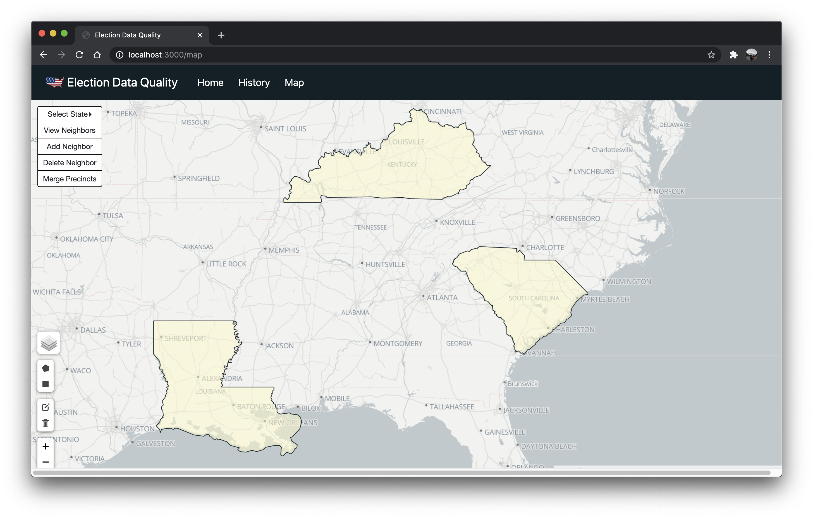
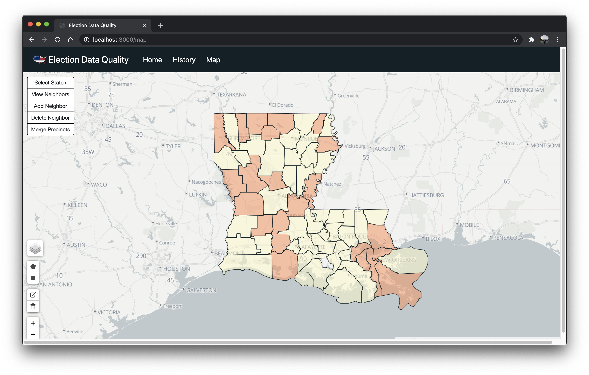
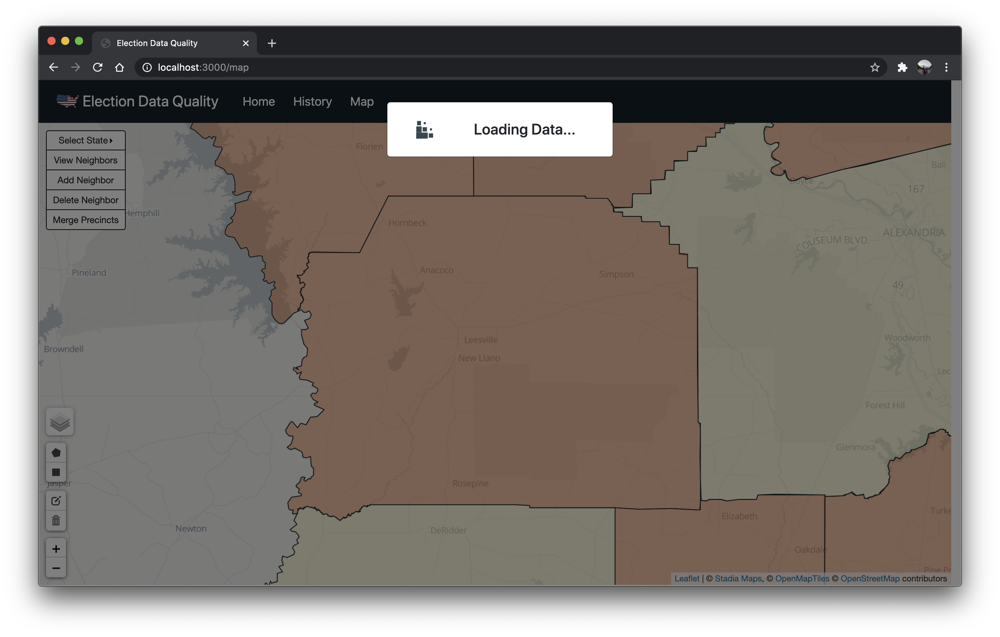
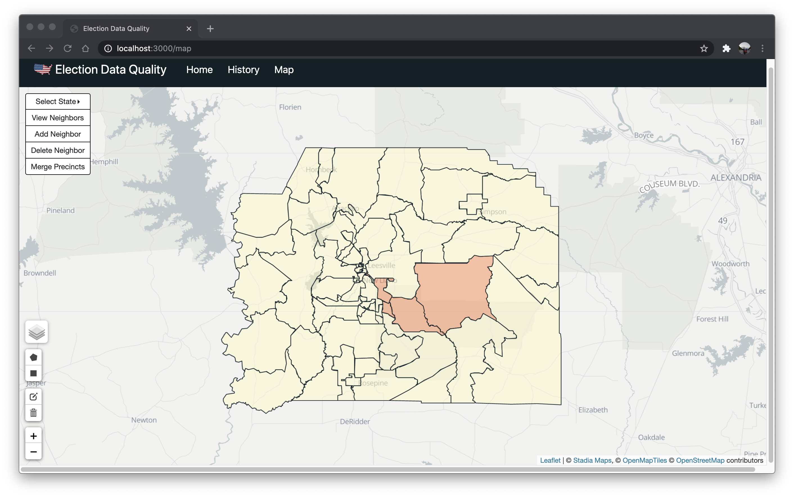
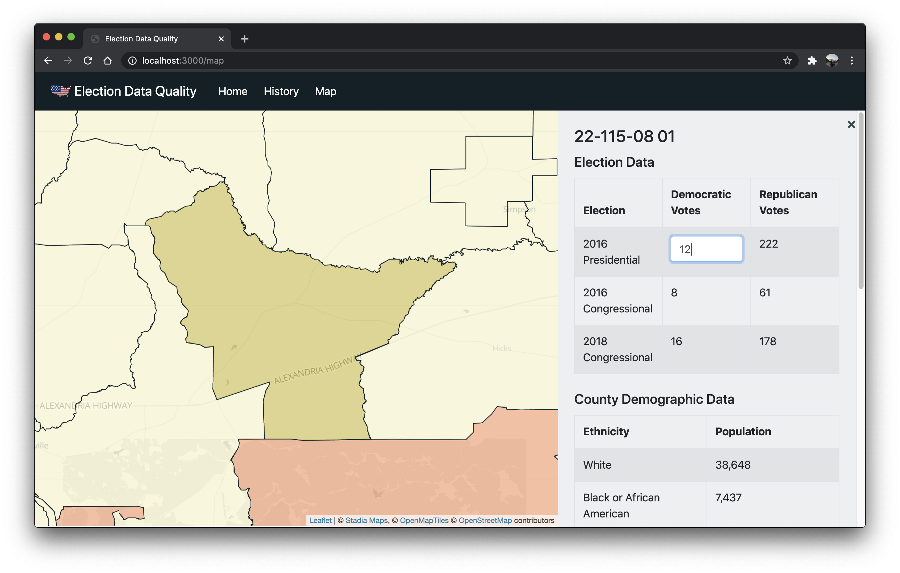
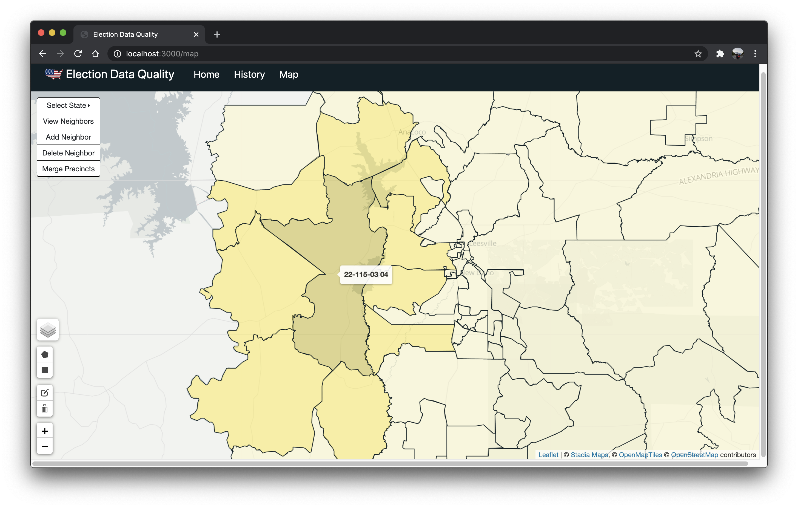
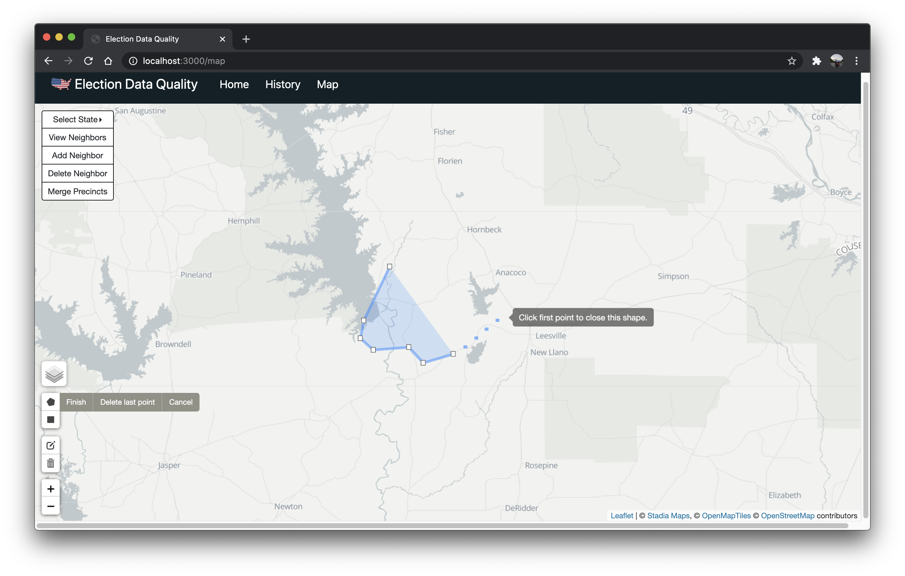
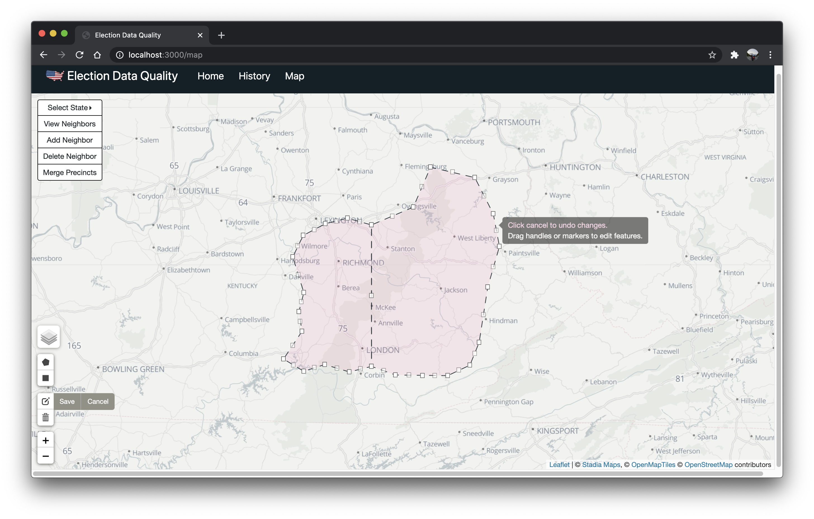

# Election Data Quality Web Application

#### https://github.com/msukmoon/election-data-quality

Election Data Quality is a web application developed with using React Library, Spring Framework, React-Leaflet, React Bootstrap and styled-components.

The U.S. redraws their [electoral precincts](https://en.wikipedia.org/wiki/Electoral_precinct) every 10 years after the census. This application is part of the project that aims to draw their precincts fairly and prevent [gerrymandering](https://en.wikipedia.org/wiki/Gerrymandering) by using computing technologies. This application lets users to easily check and edit geological and statistical election data.

  
  
  
  
  
  
  
  

## Getting Started

This repository only contains a front-end part of the application. The source code of a back-end part of the application is at this [repository](https://github.com/HOZH/hozh-416). The source code for preprocessing the election data could be provided when requested to [brendankon](https://github.com/brendankon).

### Running the Application

This will be updated later.

### Supplementary Documents

This will be updated later.

### Checking Source Codes

This will be updated later.
